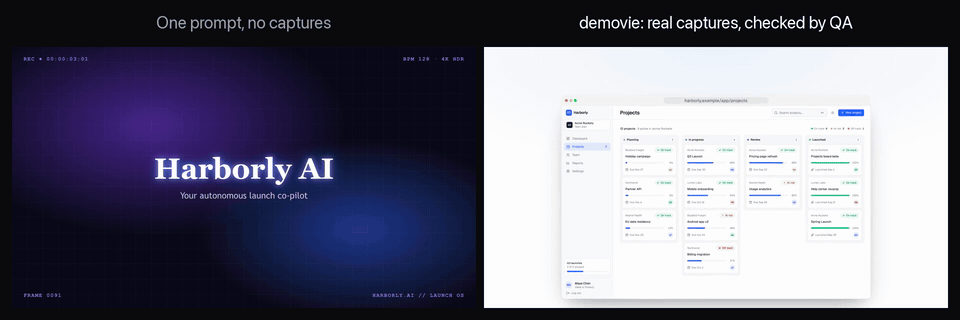
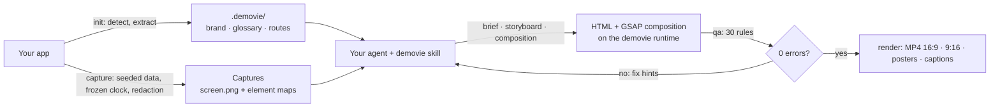
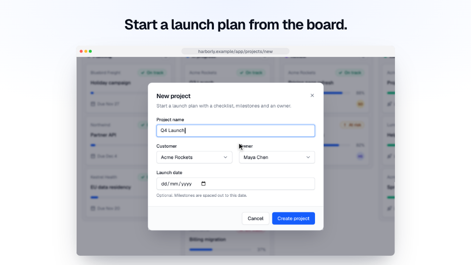
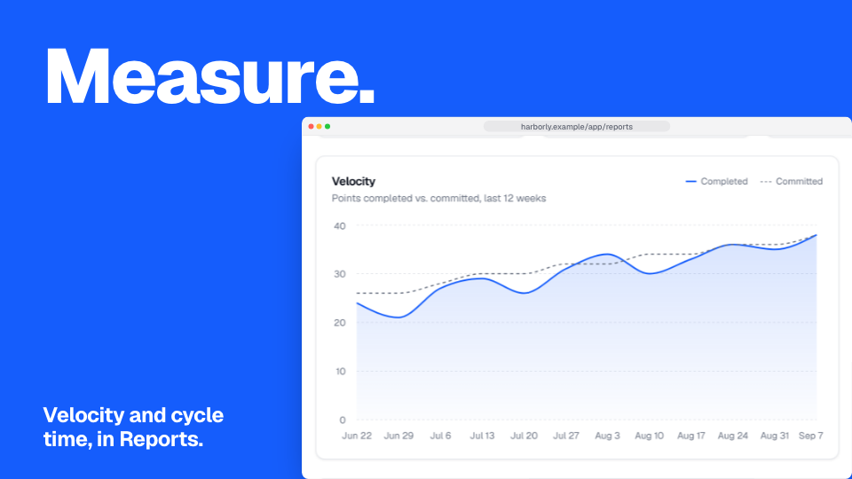
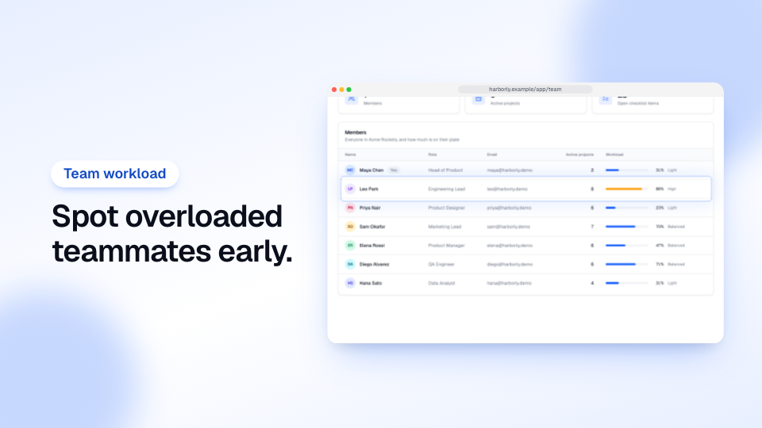
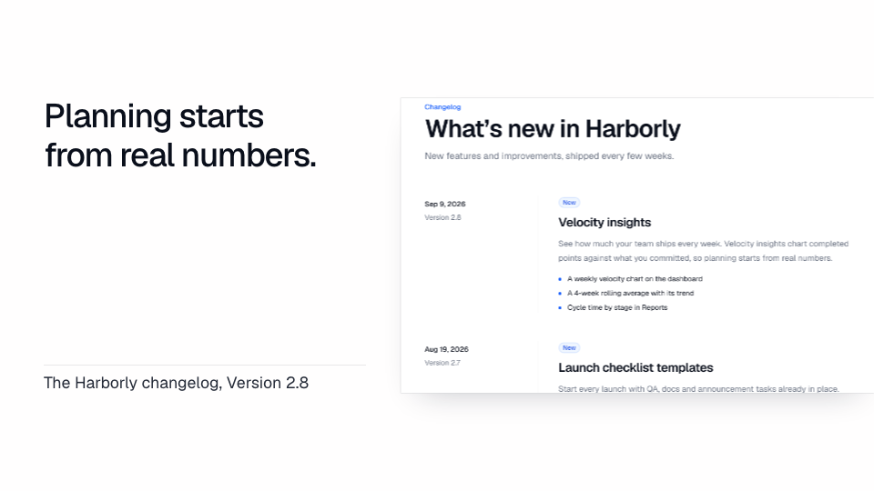
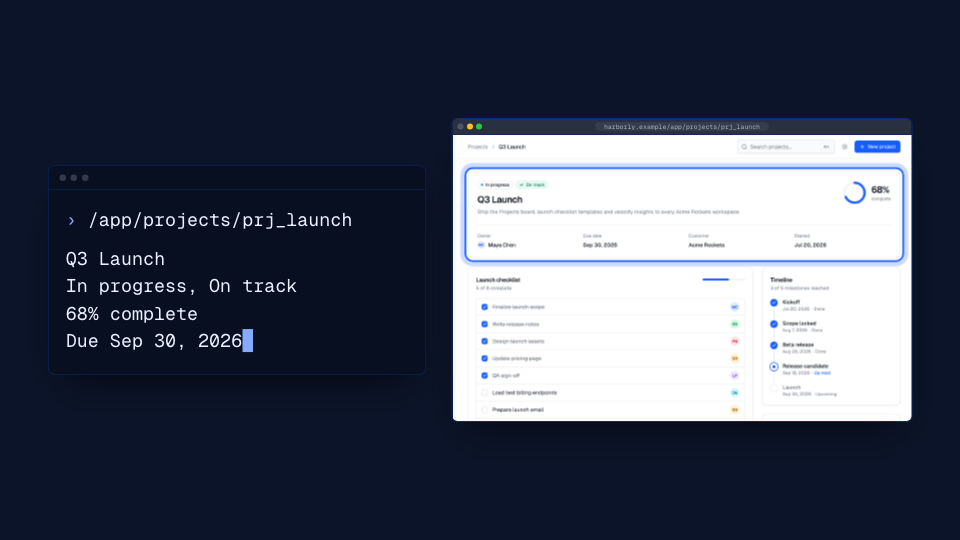
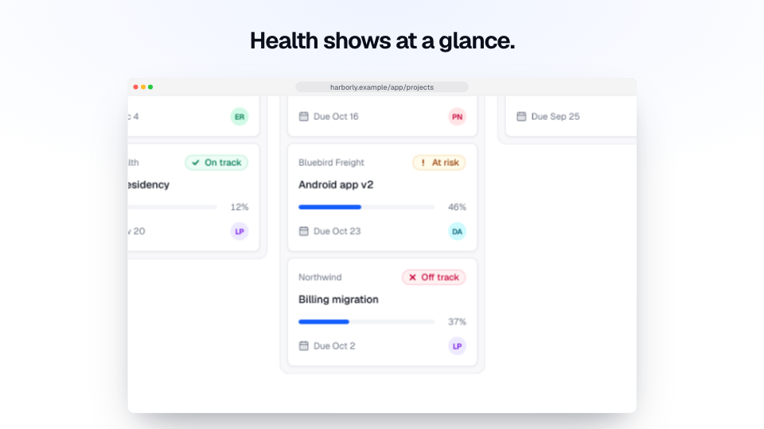
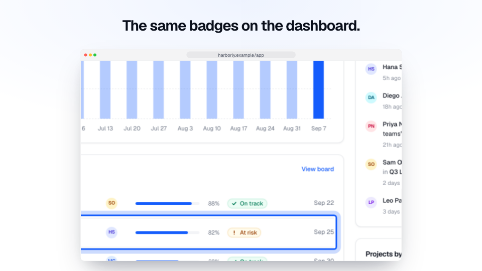
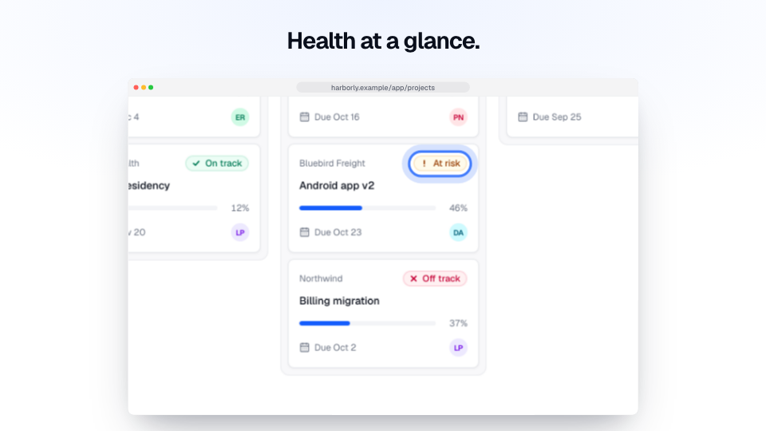

# demovie

**Your agent animates. demovie makes it true.**

Accurate, on-brand motion-graphics videos of your real web app — launch videos, feature clips, changelogs, teasers,
walkthroughs and landing-page hero loops — made by the AI coding agent you already use, from real captures of your
running app, checked by a QA engine before they render.

[](docs/media/grounded-vs-generic.mp4)

<sub>Left: a recreation of what one prompt and no captures typically gives you: an imagined dashboard, invented
metrics, HUD labels. Right: demovie, from real captures of the app, in the product's own words, with a cursor that
clicks real buttons. [Watch the MP4](docs/media/grounded-vs-generic.mp4).</sub>

## Quickstart

In your app's folder:

```bash
npx demovie init        # detect your app; extract brand, glossary and routes; set up demo data, login and the skill
npx demovie capture     # screenshots + element maps of every route and flow
npx demovie make        # start your agent with the demovie skill — or just ask it for a video
```

Then, in Claude Code, Codex or Cursor: *"Make a 30-second launch video of the Projects board with demovie."* A few
minutes of your time, then your agent works on it; the MP4s land in `.demovie/videos/<slug>/out/`.

Requirements: Node ≥ 20.19 (or Bun), ffmpeg with libx264, and an app you can run locally. Next.js is detected
automatically; other apps work with `init --url`. New here? Follow [your first video, step by
step](docs/tutorial.md).

## How it works



1. **Ground.** `init` reads your code and the running app: brand colors and fonts, your product's vocabulary, every
   route. `capture` screenshots real states with seeded demo data, a frozen clock and masked personal data, and maps
   every element (`button:create-project`, `link:q3-launch`).
2. **Direct.** Your agent follows the demovie skill: brief → capture plan → storyboard → style frames → animation. The
   runtime only shows product UI through `screen()` with real captures; cursors, zooms and highlights target element
   ids.
3. **Check.** `demovie qa` samples the video and runs 30 rules — reading time, legibility, contrast, safe areas,
   pacing, truthful clicks, invented words and numbers, determinism, loudness, audio provenance and the "AI look"
   clichés — with a fix for every failure.
4. **Render.** A deterministic frame-stepping renderer (Playwright + your ffmpeg) writes H.264 MP4s in every format,
   posters and captions, with license-clean music and SFX mixed to −16 LUFS.

## Features

- **Real captures, not imagination** — logged-in states via form login, saved sessions or scripts; multi-step flows
  in YAML or TypeScript; stable element maps; freshness tracking.
- **Your brand and your words** — colors, fonts and logos extracted from your code; a glossary that QA enforces.
- **A motion runtime** — device frames, camera moves, a truthful cursor, typing, callouts, captions, transitions; five
  style presets (`clean`, `bold`, `soft`, `editorial`, `terminal`).
- **QA you can trust** — 30 machine-checked rules, a preview player with QA overlays, contact sheets for review.
- **License-clean audio** — a deterministic music synthesizer that follows your storyboard, 12 CC0 sound effects,
  optional voiceover with your own ElevenLabs or OpenAI key, ducking and loudness normalization.
- **Changelog mode** — `demovie changes` maps commits to affected routes through the import graph; a GitHub Action
  makes a clip for every release.

## How it compares

If you want a quick launch post for a React app you just built, [brag](https://github.com/latent-spaces/brag) is one
command and tells a good story. If you want to build videos as code yourself, use Remotion or HyperFrames. demovie is
for product videos that must show your **real, current product**: screens behind a login, your own demo data, several
formats designed separately, 30 checks before anything renders, and a fresh clip on every release. We tested four
approaches on the same real app; [the comparison](docs/comparison.md) has the numbers and when to pick which.

## Works with your agent

| Agent | Skill | MCP | `demovie make` |
|---|---|---|---|
| Claude Code | `.claude/skills/demovie` or the plugin | ✓ | interactive and headless |
| Codex CLI | `.agents/skills/demovie` | ✓ | interactive and headless |
| Cursor | `.agents/skills/demovie` | ✓ (`.cursor/mcp.json`) | interactive and headless |
| Any MCP client or skills-aware agent | `npx skills add enszrlu/demovie` | `npx -y demovie mcp` | `--agent custom --agent-cmd "…"` |

demovie never logs in to AI services or touches your subscriptions: it starts the agent you installed and signed in
to, or passes through API keys in CI. See [agents](docs/agents.md) and [licensing and terms](docs/licensing-and-terms.md).

## Examples

Reference compositions in [`examples/compositions`](examples/compositions), all made from captures of the fictional
[Harborly](examples/harborly) app and all passing QA:

| `clean` | `bold` | `soft` |
|---|---|---|
|  |  |  |
| **`editorial`** | **`terminal`** | |
|  |  | |

Made by following the skill on Harborly, the same way your agent would:

| [Launch video](examples/harborly/.demovie/videos/launch) (35 s, 16:9 + 9:16) | [Changelog clip](examples/harborly/.demovie/videos/changelog) (15 s, 16:9 + 1:1) | [Teaser](examples/harborly/.demovie/videos/projects-board-teaser) (12 s, 16:9) |
|---|---|---|
|  |  |  |

The teaser came from one command, `npx demovie make --type teaser --format 16:9 --yes`, in a project that was already
set up: 3 min 21 s and $1.06 of agent time (Claude Opus 5.5), QA 0 errors and 0 warnings.

Each folder holds the brief, storyboard, `video.json` and composition. Captures, audio and MP4s are gitignored;
[CONTRIBUTING.md](CONTRIBUTING.md#regenerating-the-examples) shows how to regenerate them.

## FAQ

**Why not just prompt Opus?** A model that has never seen your product redraws a generic dashboard and invents
features, numbers and customers, or spends most of its run hunting for footage of your UI. demovie gives it your real
app and checks the result.

**Why not brag?** brag is great for a quick, fun launch post. It renders your components outside the app (with sample
data when it can't load yours), one format per run, and doesn't cover logins, personal data or releases. demovie shows
your running app with your demo data, in every format, checked by QA, and again on every release. See [the
comparison](docs/comparison.md), with both made from the same app.

**Why not Remotion?** Remotion is free only for individuals, non-profits and companies of up to three people; larger
companies need a paid license. demovie is MIT. Compositions are plain HTML + GSAP rendered by demovie's own renderer.

**Does it use my Claude subscription?** No. demovie never logs in or reads tokens. Your agent — installed and signed in
by you — uses demovie as a tool; in CI, the action uses API keys you provide.

**Where does my data go?** Nowhere: captures and videos stay in `.demovie/` in your repo, there's no telemetry, and the
only outside calls are the ones you configure (voiceover or music providers, with your key and your approval).

More in the [FAQ](docs/faq.md).

## Docs

- **Start here:** [getting started](docs/getting-started.md) · [your first video, step by step](docs/tutorial.md)
- **Guides:** [apps with a login](docs/guides/apps-with-login.md) · [capture states behind
  clicks](docs/guides/capture-flows.md) · [make the next video faster](docs/guides/follow-up-videos.md) · [a video for
  every release](docs/guides/changelog-every-release.md) · [build a video by hand](docs/guides/without-an-agent.md) ·
  [recipes](docs/recipes.md)
- **Reference:** [commands](docs/cli.md) · [config](docs/config.md) · [compositions](docs/compositions.md) · [QA
  rules](docs/qa-rules.md) · [concepts](docs/concepts.md) · [capture and auth](docs/capture-and-auth.md) · [demo
  data](docs/demo-data.md) · [styles](docs/styles.md) · [audio](docs/audio.md) · [agents](docs/agents.md) ·
  [CI](docs/ci.md)
- **Help:** [how demovie compares](docs/comparison.md) · [troubleshooting](docs/troubleshooting.md) ·
  [FAQ](docs/faq.md) · [licensing and terms](docs/licensing-and-terms.md)

All docs, in one place: [docs/](docs/README.md).

## Contributing

See [CONTRIBUTING.md](CONTRIBUTING.md): `pnpm install && pnpm build && pnpm verify`. Please read the
[code of conduct](CODE_OF_CONDUCT.md) and report security issues as described in [SECURITY.md](SECURITY.md).

## License

[MIT](LICENSE). Bundled fonts are OFL; bundled sound effects are CC0.
